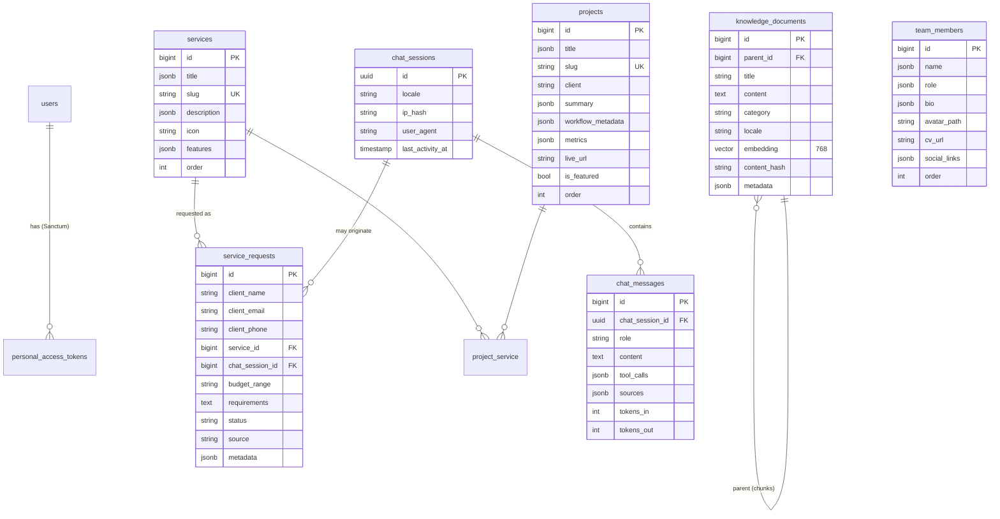

# Database Schema

PostgreSQL 16 with the `vector` extension (pgvector ≥ 0.7). All tables use `bigint` identity PKs (`$table->id()`), `timestamps()` in UTC, and snake_case names.

## 1. Conventions

| Convention | Rule |
|------------|------|
| Translatable columns | `jsonb` storing `{"ar": "...", "en": "..."}`; models use `Spatie\Translatable\HasTranslations`. `ar` is the fallback locale. |
| Free-form JSON | `jsonb` (indexable with GIN where queried). Laravel casts: `'array'` or custom `AsCollection`. |
| Ordering | Integer `order` column (quoted `"order"` in raw SQL — reserved word). Default `0`, indexed. |
| Slugs | `string(160)`, unique, kebab-case, English. |
| Enums | `string` columns validated by PHP backed enums (no Postgres enum types → painless migrations). |
| Soft deletes | Not used in v1, except `service_requests` (audit trail). |

## 2. Entity-relationship diagram



## 3. Table specifications

### 3.1 Extension migration (`0001_01_01_000000_enable_pgvector.php`)

Runs before all others.

```php
public function up(): void
{
    DB::statement('CREATE EXTENSION IF NOT EXISTS vector');
}

public function down(): void
{
    DB::statement('DROP EXTENSION IF EXISTS vector');
}
```

> The Docker init script also runs `CREATE EXTENSION IF NOT EXISTS vector;` so that the test database (`afaq_testing`) is ready too.

### 3.2 `services`

| Column | Type | Null | Notes |
|--------|------|------|-------|
| `id` | bigint PK | | |
| `title` | jsonb | no | translatable |
| `slug` | varchar(160) | no | unique |
| `description` | jsonb | no | translatable, Markdown allowed |
| `icon` | varchar(64) | yes | Lucide icon name, e.g. `workflow`, `bot`, `message-circle` |
| `features` | jsonb | no | `[{ "ar": "...", "en": "..." }]` — list of translatable bullets |
| `starting_price` | integer | yes | USD, used by `EstimateCalculator` |
| `order` | integer | no | default 0, indexed |
| timestamps | | | |

### 3.3 `projects`

| Column | Type | Null | Notes |
|--------|------|------|-------|
| `id` | bigint PK | | |
| `title` | jsonb | no | translatable |
| `slug` | varchar(160) | no | unique — used by `trigger_3d_workflow(project_slug)` |
| `client` | varchar(160) | no | |
| `summary` | jsonb | no | translatable |
| `workflow_metadata` | jsonb | no | see §4 schema |
| `metrics` | jsonb | no | see §4.3 |
| `live_url` | varchar(2048) | yes | |
| `cover_path` | varchar | yes | public disk path |
| `is_featured` | boolean | no | default false |
| `order` | integer | no | default 0 |
| timestamps | | | |

Pivot `project_service` (`project_id`, `service_id`, composite PK, cascade on delete) links case studies to the services they demonstrate.

### 3.4 `team_members`

| Column | Type | Null | Notes |
|--------|------|------|-------|
| `id` | bigint PK | | |
| `name` | jsonb | no | translatable (Arabic script + Latin) |
| `role` | jsonb | no | translatable |
| `bio` | jsonb | no | translatable |
| `avatar_path` | varchar | yes | `public` disk: `team/avatars/{uuid}.webp` |
| `cv_url` | varchar | yes | either a `public` disk path `team/cvs/{uuid}.pdf` or an absolute URL |
| `skills` | jsonb | no | `["n8n", "Laravel", "LangChain"]` |
| `social_links` | jsonb | no | `{ "linkedin": "...", "github": "...", "x": "..." }` |
| `is_active` | boolean | no | default true |
| `order` | integer | no | default 0 |
| timestamps | | | |

### 3.5 `service_requests`

| Column | Type | Null | Notes |
|--------|------|------|-------|
| `id` | bigint PK | | |
| `reference` | varchar(16) | no | unique, human-friendly `AFQ-7K2M9P` |
| `client_name` | varchar(120) | no | |
| `client_email` | varchar(254) | no | indexed |
| `client_phone` | varchar(32) | yes | E.164 normalized |
| `company` | varchar(160) | yes | |
| `service_id` | bigint FK → services | yes | `nullOnDelete` |
| `chat_session_id` | uuid FK → chat_sessions | yes | set when created by the AI agent |
| `budget_range` | varchar(32) | no | enum `BudgetRange`: `lt_1k`, `1k_5k`, `5k_15k`, `15k_50k`, `gt_50k` |
| `timeline` | varchar(32) | yes | enum `Timeline`: `asap`, `1_month`, `1_3_months`, `flexible` |
| `requirements` | text | no | |
| `status` | varchar(24) | no | enum `RequestStatus`: `new` → `contacted` → `qualified` → `won` / `lost`; default `new`, indexed |
| `source` | varchar(16) | no | `web_form` / `ai_agent` / `admin` |
| `estimate` | jsonb | yes | `{ "min": 2500, "max": 4000, "currency": "USD" }` |
| `metadata` | jsonb | no | `{ "locale", "utm", "ip_hash", "n8n": { "notified_at", "attempts" } }` |
| timestamps + `deleted_at` | | | soft deletes |

### 3.6 `knowledge_documents`

| Column | Type | Null | Notes |
|--------|------|------|-------|
| `id` | bigint PK | | |
| `parent_id` | bigint FK → self | yes | null = source document; set = chunk. `cascadeOnDelete` |
| `title` | varchar(255) | no | |
| `content` | text | no | source text or chunk text |
| `category` | varchar(48) | no | `faq`, `service`, `pricing`, `process`, `company`, `case_study` |
| `locale` | varchar(5) | no | `ar` / `en` — retrieval filters on the user's locale first |
| `chunk_index` | smallint | yes | position within parent |
| `embedding` | `vector(768)` | yes | null until indexed |
| `content_hash` | char(64) | yes | sha256 of content — skip re-embedding unchanged chunks |
| `embedding_model` | varchar(64) | yes | e.g. `gemini/gemini-embedding-2` — detects stale vectors after a driver swap |
| `indexed_at` | timestamp | yes | |
| `metadata` | jsonb | no | `{ "source_url", "tags", "service_slug" }` |
| timestamps | | | |

Vector column & index (raw SQL inside the migration — Laravel 12's schema builder supports `vector()` on pgsql, the index is still raw):

```php
Schema::create('knowledge_documents', function (Blueprint $table) {
    // ...
    $table->vector('embedding', dimensions: 768)->nullable();
});

DB::statement(
    'CREATE INDEX knowledge_documents_embedding_hnsw
     ON knowledge_documents USING hnsw (embedding vector_cosine_ops)
     WITH (m = 16, ef_construction = 64)'
);
DB::statement('CREATE INDEX knowledge_documents_locale_category_idx ON knowledge_documents (locale, category)');
```

Similarity query (cosine similarity = `1 - cosine distance`):

```sql
SELECT id, parent_id, title, content, category,
       1 - (embedding <=> :query::vector) AS score
FROM knowledge_documents
WHERE embedding IS NOT NULL
  AND parent_id IS NOT NULL          -- search chunks only
  AND locale = ANY(:locales)         -- ['ar'] or ['ar','en']
ORDER BY embedding <=> :query::vector
LIMIT :k;
```

`SET LOCAL hnsw.ef_search = 40;` is issued in the same transaction for recall tuning.

### 3.7 `chat_sessions`

| Column | Type | Notes |
|--------|------|-------|
| `id` | uuid PK | generated server-side, returned to client, stored in `localStorage` |
| `locale` | varchar(5) | |
| `ip_hash` | char(64) | `sha256(ip . app.key)` — no raw IPs stored |
| `user_agent` | varchar(512) | truncated |
| `last_activity_at` | timestamp | indexed; sessions idle > 30 days are pruned by `model:prune` |
| timestamps | | |

### 3.8 `chat_messages`

| Column | Type | Notes |
|--------|------|-------|
| `id` | bigint PK | |
| `chat_session_id` | uuid FK | `cascadeOnDelete`, indexed with `created_at` |
| `role` | varchar(16) | `user` / `assistant` / `tool` / `system` |
| `content` | text | PII-scrubbed before persistence ([prompt_guard.md](../05_security/prompt_guard.md)) |
| `tool_calls` | jsonb | `[{ "name", "args", "result_summary" }]` |
| `sources` | jsonb | `[{ "document_id", "score" }]` |
| `tokens_in` / `tokens_out` | integer | from driver usage metadata (nullable) |
| `flagged` | boolean | PromptGuard verdict |
| timestamps | | |

### 3.9 Framework tables

`users` (admins only — `is_admin` boolean), `password_reset_tokens`, `sessions`, `cache`, `jobs`, `failed_jobs`, `personal_access_tokens` (Sanctum) — Laravel 12 defaults.

## 4. JSON schemas

### 4.1 `projects.workflow_metadata`

Drives the 3D scene. Coordinates are in scene units (1 unit ≈ one node width). `exploded` is an **offset** added to `position` when the scene is in exploded mode.

```ts
type NodeKind = 'trigger' | 'router' | 'action' | 'ai' | 'storage';

interface WorkflowMetadata {
  version: 1;
  camera: { position: [number, number, number]; target: [number, number, number] };
  nodes: Array<{
    id: string;                      // "webhook", "sentiment"
    kind: NodeKind;
    label: { ar: string; en: string };
    n8nType: string;                 // "n8n-nodes-base.webhook"
    position: [number, number, number];
    exploded: [number, number, number];  // offset vector
    color?: string;                  // override accent
    stats?: { avgMs: number; executions: number };
  }>;
  edges: Array<{
    from: string;                    // node id
    to: string;
    fromPort?: string;               // "main", "true", "false"
    type?: "main" | "ai";            // "ai": AI sub-node (model, memory, tool) → its agent; drawn dashed, sub-node is round
    label?: { ar: string; en: string };
    animated?: boolean;              // packet particles
  }>;
}
```

Example (Omnichannel Support Sync):

```json
{
  "version": 1,
  "camera": { "position": [0, 2.5, 9], "target": [0, 0, 0] },
  "nodes": [
    { "id": "webhook",   "kind": "trigger", "label": {"ar": "استقبال Webhook", "en": "Webhook"}, "n8nType": "n8n-nodes-base.webhook", "position": [-4.5, 0, 0], "exploded": [-1.5, 1.2, 0.8] },
    { "id": "sentiment", "kind": "ai",      "label": {"ar": "تحليل المشاعر", "en": "Sentiment AI"}, "n8nType": "@n8n/n8n-nodes-langchain.sentimentAnalysis", "position": [-1.5, 0, 0], "exploded": [-0.5, -1.4, 1.1] },
    { "id": "router",    "kind": "router",  "label": {"ar": "الموجّه", "en": "Router"}, "n8nType": "n8n-nodes-base.switch", "position": [1.5, 0, 0], "exploded": [0.6, 1.5, -0.9] },
    { "id": "ticket",    "kind": "action",  "label": {"ar": "حل التذكرة", "en": "Ticket Resolution"}, "n8nType": "n8n-nodes-base.zendesk", "position": [4.5, 0, 0], "exploded": [1.6, -1.0, 0.7] }
  ],
  "edges": [
    { "from": "webhook", "to": "sentiment", "animated": true },
    { "from": "sentiment", "to": "router", "animated": true },
    { "from": "router", "to": "ticket", "fromPort": "negative", "animated": true }
  ]
}
```

### 4.2 `services.features`

```json
[
  { "ar": "عُقد n8n مخصصة بلغة TypeScript", "en": "Custom TypeScript n8n nodes" },
  { "ar": "اختبارات آلية ونشر عبر CI", "en": "Automated tests & CI publishing" }
]
```

### 4.3 `projects.metrics`

```ts
interface ProjectMetrics {
  avgExecutionMs: number;     // 840
  failureRate: number;        // 0  (percentage)
  nodesCount: number;         // derived but cached for listing cards
  monthlyRuns: number;        // 120000
  hoursSavedPerMonth: number; // 310
}
```

## 5. Seed data overview (Phase 2)

| Table | Rows | Highlights |
|-------|------|-----------|
| `services` | 5 | Custom n8n Nodes · AI Voice & Chat Agents · CRM Sync (HubSpot/Salesforce) · WhatsApp Business Automation · E-commerce Logistics Routing |
| `projects` | 3 | Omnichannel Support Sync · Autonomous Invoice Extractor · Lead Enrichment Engine (each with full `workflow_metadata`) |
| `team_members` | 4 | Founder & Automation Architect · Senior n8n Specialist · Full-Stack Engineer · AI Engineer |
| `knowledge_documents` | ~30 sources (ar + en) | FAQ, service docs, pricing ranges, process, company profile |
| `service_requests` | 25 | Spread across statuses/sources for a realistic dashboard (factory) |
| `users` | 1 | `admin@afaqn8n.me` — password from `ADMIN_SEED_PASSWORD` env |

Seeders are idempotent (`updateOrCreate` by slug/email) so `db:seed` can be re-run safely.
