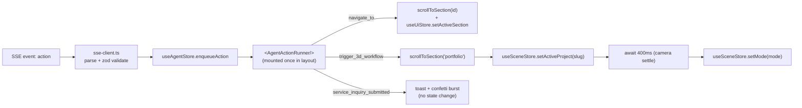

# State Management & the 3D Scene Bridge

Client state lives in **Zustand** stores. Server data (services, projects, team) is fetched in Server Components and passed down as props — it is **not** duplicated into Zustand. Zustand owns only interactive, cross-component state:

| Store | File | Owns |
|-------|------|------|
| `useSceneStore` | `src/stores/scene-store.ts` | Active workflow, assembled/exploded mode, selected/hovered node, camera targets, quality tier |
| `useAgentStore` | `src/stores/agent-store.ts` | Copilot open state, session id, message list, streaming status, action queue |
| `useUiStore` | `src/stores/ui-store.ts` | Theme, active section, modals (CV preview, booking prefill), reduced-motion |

Why Zustand: R3F components render outside React DOM's tree semantics (inside `<Canvas>`), and the AI widget must drive the scene without prop-drilling. Zustand stores are plain modules usable from both trees and from non-React code (`useSceneStore.getState()` inside `useFrame`), with selector-based subscriptions to avoid re-rendering the canvas.

## 1. `useSceneStore`

```ts
export type WorkflowMode = 'assembled' | 'exploded';
export type QualityTier = 'high' | 'medium' | 'low' | 'fallback2d';

interface CameraGoal {
  position: [number, number, number];
  target: [number, number, number];
  durationMs?: number;
}

interface SceneState {
  activeProjectSlug: string | null;
  mode: WorkflowMode;
  /** 0 → assembled, 1 → exploded; animated value read by useFrame */
  explodeProgress: number;
  selectedNodeId: string | null;
  hoveredNodeId: string | null;
  cameraGoal: CameraGoal | null;
  quality: QualityTier;
  autoRotate: boolean;

  setActiveProject: (slug: string) => void;
  setMode: (mode: WorkflowMode) => void;
  toggleMode: () => void;
  selectNode: (id: string | null) => void;
  hoverNode: (id: string | null) => void;
  focusCamera: (goal: CameraGoal) => void;
  setQuality: (q: QualityTier) => void;
  /** internal: tweened by <ExplodeDriver/> */
  _setExplodeProgress: (p: number) => void;
}
```

Rules:
- `mode` is the **intent**; `explodeProgress` is the **animated value**. Only `<ExplodeDriver/>` (a GSAP tween inside the canvas) writes `explodeProgress`. Components read it in `useFrame` via `useSceneStore.getState()` (transient read — no React re-render per frame).
- `setActiveProject` resets `mode` to `assembled` and `selectedNodeId` to `null`.
- `quality` is set by `<PerformanceMonitor>` (drei) — on decline we step down one tier; `fallback2d` swaps the canvas for an SVG diagram.

## 2. `useAgentStore`

```ts
export type ChatRole = 'user' | 'assistant' | 'tool';

export interface ChatMessage {
  id: string;
  role: ChatRole;
  content: string;
  createdAt: string;
  sources?: Array<{ documentId: number; title: string; score: number }>;
  actions?: AgentAction[];   // rendered as action bubbles
  status?: 'streaming' | 'complete' | 'error';
}

export type AgentAction =
  | { id: string; type: 'navigate_to'; payload: { sectionId: SectionId } }
  | { id: string; type: 'trigger_3d_workflow'; payload: { projectSlug: string; mode: WorkflowMode } }
  | { id: string; type: 'service_inquiry_submitted'; payload: { reference: string; serviceType: string } };

export type SectionId = 'hero' | 'services' | 'portfolio' | 'team' | 'order';

interface AgentState {
  isOpen: boolean;
  sessionId: string | null;          // persisted (localStorage) via zustand/middleware persist
  messages: ChatMessage[];
  status: 'idle' | 'connecting' | 'streaming' | 'error';
  error: string | null;
  pendingActions: AgentAction[];     // FIFO; drained by <AgentActionRunner/>
  abortController: AbortController | null;

  open: () => void;
  close: () => void;
  send: (text: string, locale: 'ar' | 'en') => Promise<void>;
  stop: () => void;
  enqueueAction: (a: AgentAction) => void;
  shiftAction: () => AgentAction | undefined;
  reset: () => void;
}
```

Persistence: only `sessionId` and the last 30 `messages` are persisted (`partialize`). Streaming state is never persisted.

## 3. `useUiStore`

```ts
interface UiState {
  theme: 'dark' | 'light';                // default 'dark'; mirrored to <html class="dark">
  activeSection: SectionId;               // updated by IntersectionObserver
  cvPreview: { memberId: number; url: string } | null;
  bookingPrefill: Partial<BookingDraft> | null;
  prefersReducedMotion: boolean;

  setTheme: (t: 'dark' | 'light') => void;
  setActiveSection: (s: SectionId) => void;
  openCvPreview: (memberId: number, url: string) => void;
  closeCvPreview: () => void;
  prefillBooking: (d: Partial<BookingDraft>) => void;
}
```

Locale is **not** in Zustand — it is the URL segment (`/ar`, `/en`) owned by `next-intl`.

## 4. The agent → scene bridge



`AgentActionRunner` contract:

```ts
// src/components/assistant/agent-action-runner.tsx
const handlers: { [K in AgentAction['type']]: (a: Extract<AgentAction, { type: K }>) => Promise<void> } = {
  navigate_to: async ({ payload }) => scrollToSection(payload.sectionId),
  trigger_3d_workflow: async ({ payload }) => {
    await scrollToSection('portfolio');
    useSceneStore.getState().setActiveProject(payload.projectSlug);
    await wait(400);
    useSceneStore.getState().setMode(payload.mode);
  },
  service_inquiry_submitted: async ({ payload }) => toast.success(t('booking.submitted', payload)),
};
```

Guarantees:
1. **Sequential** — actions run one at a time in arrival order (a running flag + `shiftAction`).
2. **Validated** — every action payload is parsed with a `zod` schema; unknown types or unknown `projectSlug`s are dropped and logged, never executed.
3. **Reduced motion** — when `prefersReducedMotion`, scroll is instant and the explode tween duration is 0.
4. **Idempotent** — re-running the same action leaves the same state.

## 5. Store file layout

```
src/stores/
├── scene-store.ts
├── agent-store.ts
├── ui-store.ts
├── selectors.ts          # memoized selectors, e.g. selectIsExploded
└── __tests__/            # Vitest: pure state transitions
```

Stores are created with `create<State>()(devtools(...))` in development only; no middleware in production except `persist` on the agent store.

## 6. As built (Phase 4)

- **Theme is not in `useUiStore`.** next-themes owns it (ADR-013). `useUiStore` holds `activeSection`, `mobileNavOpen`, `cvPreview` and `bookingPrefill`.
- **`useSceneStore.registerProjects([{slug, title}])`** is called by the portfolio with the projects it actually rendered. `setActiveProject(slug)` returns `false` for unknown slugs, so the agent can only target real projects. `projectTitles` feeds agent toasts.
- **`useAgentStore`** persists `sessionId` + the last 30 completed messages (`afaq-copilot`) with `skipHydration: true`. `<AgentActionRunner/>` rehydrates on mount to avoid SSR mismatches. `send()` streams via `src/lib/api/sse-client.ts` and applies `reset` events by replacing the partial text.
- **Action execution** is a plain module: `src/lib/agent/run-action.ts` (`runAgentAction`, `drainAgentActions`) with a module-level lock, so actions run strictly in order. The component only maps outcomes to localized toasts (sonner).
- **Validation:** `src/lib/agent/actions.ts` (zod discriminated union) drops unknown action types and malformed payloads before they reach the stores.
- **Verified live:** a Copilot message in Arabic ("اعرض لي مشروع مستخرج الفواتير مفككاً") streamed from Gemini. The `trigger_3d_workflow` action switched the portfolio to the invoice project, exploded it, highlighted the nav item and showed an Arabic toast.
- **Dev/E2E hook:** in non-production builds `window.__afaq = { agent, scene }` exposes the stores for Playwright and manual checks.

## 7. As built (Phase 5)

- **`setMode(mode, source)`** takes `source: "user" | "agent" | "scroll"` (default `"user"`). Scroll-sourced changes apply only while `autoExplode` is true. The first user or agent change sets it to false for the visit. `AgentActionRunner` passes `"agent"`.
- **Quality**:
  - `detectQuality(tier)`: records the device tier once.
  - `setQuality(tier)`: the visitor's 2D/3D switch. It **pins** the tier.
  - `adaptQuality("up" | "down")`: used by PerformanceMonitor. It moves only between high and low and respects the pin.
  - `fallbackTo2d(reason)`: reason is `performance`, `unsupported`, `context-lost` or `error`. `performance` respects the pin.
  - `recover3d()`: remounts the canvas once after the first context loss.

  `fallbackReason` drives the localized notice. `renderAttempt` keys each canvas mount, so a remount fades in only after its own first frame.
- **`explodeProgress`** is the mean of the per-node springs, written by `WorkflowWorld` when it changes. DOM code should still read `mode`.
- **Selection and hover** (`selectedNodeId`, `hoveredNodeId`) are shared by the 3D scene, the 2D diagram and the step list, so hovering any of them highlights the other two. Escape or a click on empty canvas clears the selection, and the camera glides back.
