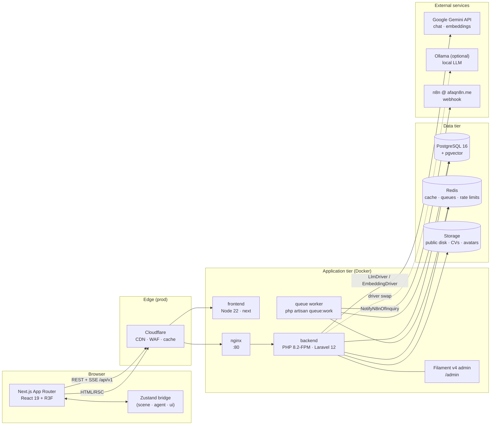
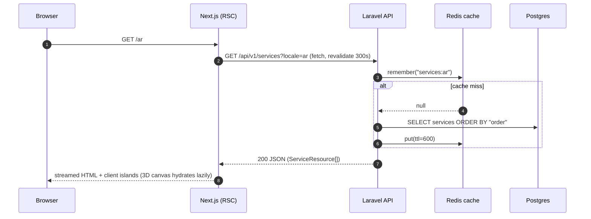
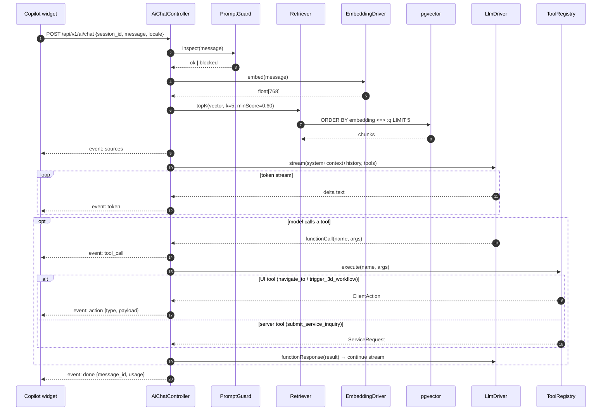
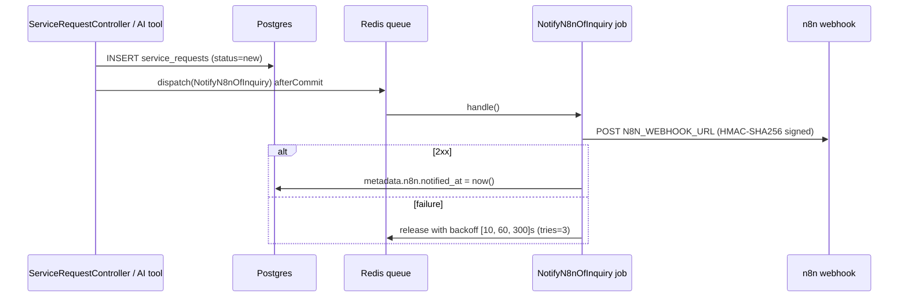

# System Overview

## 1. Architecture at a glance

The platform is **headless**: Laravel 12 exposes a JSON/SSE API and hosts the Filament admin; Next.js renders all public UI (including the 3D scenes) and talks to the API over HTTP. No Blade views are served to visitors.



| Container | Image / runtime | Port (dev) | Responsibility |
|-----------|-----------------|-----------|----------------|
| `postgres` | `pgvector/pgvector:pg16` | 5432 | Relational data + vector search |
| `redis` | `redis:alpine` | 6379 | Cache, queues, throttle buckets, chat session TTL |
| `backend` | `php:8.2-fpm-alpine` (custom) | 9000 (internal) | Laravel API, Filament, artisan |
| `nginx` | `nginx:alpine` | 8000 → 80 | HTTP front for FPM, static `public/` |
| `frontend` | `node:22-alpine` | 3000 | Next.js dev server / SSR |
| `queue` *(Phase 3)* | same as `backend` | — | `queue:work redis` for webhook + indexing jobs |

## 2. Core interaction flows

### 2.1 Content page render



### 2.2 AI chat with tool calling (SSE)



**Key rule:** UI tools never touch the server state; they produce a `ClientAction` that the frontend executes through the Zustand bridge (see [state_management.md](state_management.md)). Server tools (`submit_service_inquiry`) are validated with the same `FormRequest` rules as the public booking endpoint.

### 2.3 Inquiry → n8n notification



### 2.4 Knowledge ingestion

Admin edits a knowledge document in Filament → clicks **Re-index knowledge** → `IndexKnowledgeJob` (or `php artisan rag:index-knowledge`) chunks, embeds and upserts vectors. See [rag_and_ai_agent.md](../04_features/rag_and_ai_agent.md).

## 3. Backend module boundaries

```
backend/app/
├── Console/Commands/          # rag:index-knowledge
├── Models/                    # Eloquent models (Laravel convention; Filament discovers them here)
├── Domain/                    # Pure business logic (no HTTP)
│   ├── Catalog/               # WorkflowMetadata (3D graph normaliser/validator)
│   ├── Inquiry/               # Enums, EstimateCalculator, ReferenceGenerator, CreateServiceRequest (Phase 3)
│   └── Knowledge/             # KnowledgeCategory enum, Chunker (Phase 3)
├── Services/AI/
│   ├── Contracts/             # LlmDriver, EmbeddingDriver, Tool
│   ├── Drivers/Llm/           # GeminiLlmDriver, OllamaLlmDriver, FakeLlmDriver
│   ├── Drivers/Embedding/     # GeminiEmbeddingDriver, OllamaEmbeddingDriver, FakeEmbeddingDriver
│   ├── Tools/                 # NavigateTo, Trigger3dWorkflow, SubmitServiceInquiry
│   ├── LlmManager.php / EmbeddingManager.php  # Laravel Managers resolving drivers from config/ai.php
│   ├── Retriever.php          # pgvector similarity search
│   ├── PromptGuard.php        # injection + PII scrubbing
│   └── ChatOrchestrator.php   # RAG + tool loop, emits SSE events
├── Http/
│   ├── Controllers/Api/V1/    # thin controllers
│   ├── Requests/              # FormRequests (validation)
│   └── Resources/             # JsonResource transformers (locale-aware)
├── Jobs/                      # NotifyN8nOfInquiry, IndexKnowledgeJob
├── Filament/                  # Resources, Pages, Widgets (admin)
└── Policies/
```

Rules:
- Controllers are thin: validate (FormRequest) → call a Domain action → return a Resource.
- Domain code never imports from `Http/`.
- `Services/AI` depends only on contracts; concrete drivers are bound in `AiServiceProvider`.

## 4. Frontend module boundaries

```
frontend/src/
├── app/[locale]/              # layout.tsx (dir/lang), page.tsx (sections)
├── components/
│   ├── three/                 # Canvas wrapper, nodes, edges, particles, scenes
│   ├── sections/              # Hero, Services, Portfolio, Team, Booking
│   ├── assistant/             # Copilot widget, message list, action bubbles
│   └── ui/                    # shadcn/ui primitives
├── stores/                    # Zustand: scene, agent, ui
├── lib/api/                   # typed fetch client + SSE parser
├── i18n/                      # next-intl routing + request config
└── messages/{ar,en}.json      # UI copy
```

## 5. Cross-cutting concerns

| Concern | Approach |
|---------|----------|
| Localization | `?locale=` or `Accept-Language` → `SetLocale` middleware; Resources output the requested locale with `ar` fallback. |
| Caching | Redis `Cache::remember` per locale for read endpoints; busted by model observers. Next.js `fetch` revalidation 300s. |
| Errors | RFC 7807 everywhere ([error_handling.md](../02_api_specs/error_handling.md)). |
| Observability | Structured JSON logs (`stack` → `stderr` in Docker); `X-Request-Id` propagated from nginx. |
| Security | Sanctum, CORS allow-list, throttles, PromptGuard ([05_security](../05_security/api_security.md)). |
