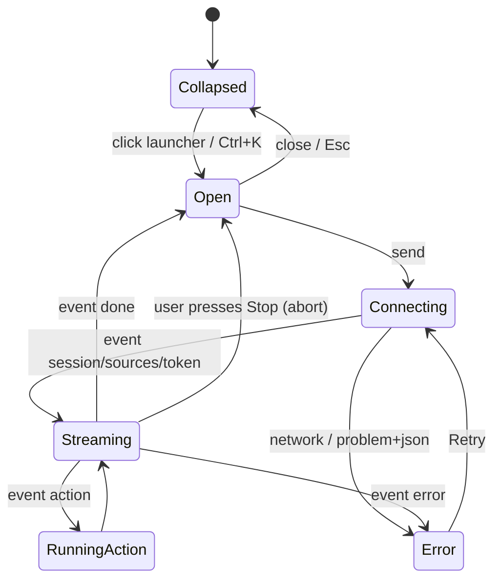

# Afaq Copilot — AI Assistant UI

A floating, collapsible "cyberpunk console" chat widget available on every page. It streams answers from `/api/v1/ai/chat` (SSE), shows retrieved sources, and renders **action bubbles** for tool calls that drive the page (scroll, 3D explode, booking).

## 1. Anatomy

```
┌──────────────────────────────────────────┐
│ ◉ Afaq Copilot          ● online   ─  ✕ │  header: status LED (cyan pulse), minimize, close
├──────────────────────────────────────────┤
│  [assistant] مرحباً! كيف أساعدك اليوم؟   │
│                    [user] أرني مشروع… ▸  │
│  [assistant] بالتأكيد ▌ (streaming caret) │
│   ┌ ⚡ تم تفكيك "مستخرج الفواتير" 3D  ↺ ┐ │  action bubble (re-run)
│   └──────────────────────────────────────┘ │
│   sources: [FAQ · 0.84] [Case study · 0.79]│  collapsible chips
├──────────────────────────────────────────┤
│ [quick prompts: الخدمات | الأسعار | احجز]│
│ ┌──────────────────────────────┐ 🎤  ➤  │  textarea (auto-grow), mic, send/stop
└──────────────────────────────────────────┘
```

- **Launcher**: 56 px circular FAB, bottom-end corner (`end-6 bottom-6` → flips in RTL), orange glow ring, animated "data pulse" border; badge when a proactive tip is available.
- **Panel**: 380×600 desktop (resizable to 480×720), full-screen sheet on < 640 px. `bg-surface/85 backdrop-blur-xl`, 1 px `border-pulse/30`, scanline overlay (CSS gradient, disabled in light mode).
- Framer Motion: launcher → panel morph (`layoutId="copilot"`), messages fade/slide from the start edge.

## 2. States



## 3. Streaming client

`fetch` + `ReadableStream` (not `EventSource`, which can't POST):

```ts
// src/lib/api/sse-client.ts
export async function streamChat(
  body: ChatRequest,
  handlers: {
    onSession(id: string): void;
    onSources(s: Source[]): void;
    onToken(delta: string): void;
    onToolCall(c: ToolCall): void;
    onAction(a: AgentAction): void;
    onToolResult(r: ToolResult): void;
    onDone(d: DoneEvent): void;
    onError(p: ProblemDetails): void;
  },
  signal: AbortSignal,
): Promise<void> {
  const res = await fetch(`${API_URL}/ai/chat`, {
    method: 'POST',
    headers: { 'Content-Type': 'application/json', Accept: 'text/event-stream' },
    body: JSON.stringify(body),
    signal,
  });
  if (!res.ok) return handlers.onError(await res.json());

  const reader = res.body!.pipeThrough(new TextDecoderStream()).getReader();
  let buffer = '';
  for (;;) {
    const { value, done } = await reader.read();
    if (done) break;
    buffer += value;
    let idx;
    while ((idx = buffer.indexOf('\n\n')) !== -1) {
      const frame = buffer.slice(0, idx);
      buffer = buffer.slice(idx + 2);
      dispatchFrame(parseFrame(frame), handlers); // zod-validated per event type
    }
  }
}
```

- Tokens are appended via a `requestAnimationFrame`-batched buffer (avoids re-rendering per token).
- Markdown rendering: `react-markdown` + `remark-gfm`, sanitized (no raw HTML), links open in new tab with `rel="noopener"`.
- Auto-scroll sticks to bottom unless the user scrolled up (then a "↓ new messages" pill appears).
- **Stop** aborts the `AbortController`; partial message is kept with status `complete`.

## 4. Action bubbles

Every `action` event becomes a bubble attached to the current assistant message **and** is enqueued to `useAgentStore.pendingActions` (executed by `AgentActionRunner`, see [state_management.md](../01_architecture/state_management.md)).

| Action type | Icon | Bubble copy (ar / en) | Bubble button |
|-------------|------|------------------------|---------------|
| `navigate_to` | `Compass` | انتقلت إلى قسم «{section}» / Jumped to {section} | "Go again" |
| `trigger_3d_workflow` | `Boxes` | تم {تفكيك/تجميع} «{project}» / {Exploded/Assembled} {project} | "Toggle" (flips mode) |
| `service_inquiry_submitted` | `CheckCircle2` | تم تسجيل طلبك رقم {ref} / Request {ref} submitted | "Copy ref" |

`tool_call` events for `submit_service_inquiry` show an interim "Submitting your request…" bubble with a spinner, replaced on `tool_result`.

**Confirmation before booking:** the system prompt requires the model to summarize collected details and ask the user to confirm before calling `submit_service_inquiry` (see [rag_and_ai_agent.md](../04_features/rag_and_ai_agent.md)). The UI additionally renders the model's summary as a structured card with "Confirm" / "Edit" quick replies.

## 5. Input

- Textarea: Enter sends, Shift+Enter newline; 2000-char limit with counter after 1500.
- `dir="auto"` so Arabic/English input aligns naturally.
- **Voice input**: Web Speech API (`webkitSpeechRecognition` / `SpeechRecognition`), `lang` = `ar-SA` or `en-US` by locale, interim results shown in the textarea. Feature-detected — the mic button is hidden when unsupported (Firefox) — no audio is sent to our servers.
- Quick prompts (localized) appear when the conversation is empty and after `done`.
- Context: each request includes `context.active_section` from `useUiStore` so the agent can answer "what am I looking at?".

## 6. Accessibility

- Launcher `aria-label`, `aria-expanded`, `aria-controls`.
- Panel is a non-modal `role="dialog"` with `aria-labelledby`; focus moves to the textarea on open and returns to the launcher on close.
- Message list `role="log"` + `aria-live="polite"`; tokens are announced per **completed sentence** (debounced) not per token.
- Keyboard: `Ctrl/⌘+K` toggle, `Esc` close, `↑` edits last user message when input is empty.
- Respects `prefers-reduced-motion` (no morph, no scanlines animation).

## 7. Session persistence

`sessionId` and last 30 messages persisted in `localStorage` (`afaq-copilot`). On open, if a persisted session exists but local messages are missing, hydrate from `GET /ai/sessions/{id}/messages`. "New chat" clears both.

## 8. File layout

```
src/components/assistant/
├── copilot-launcher.tsx
├── copilot-panel.tsx
├── message-list.tsx
├── message-bubble.tsx
├── action-bubble.tsx
├── source-chips.tsx
├── composer.tsx              # textarea + mic + send/stop
├── use-speech-input.ts
└── agent-action-runner.tsx
```
