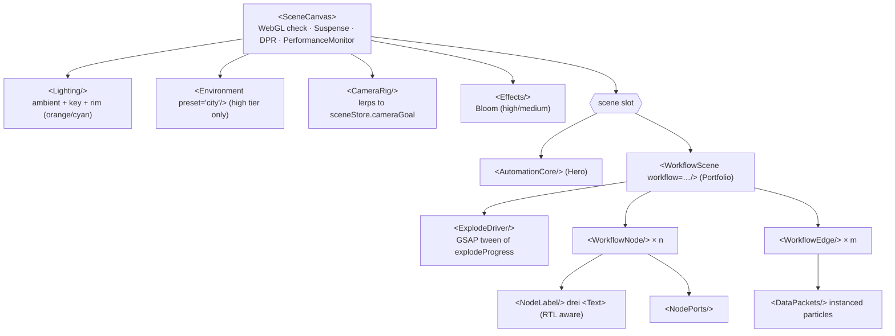
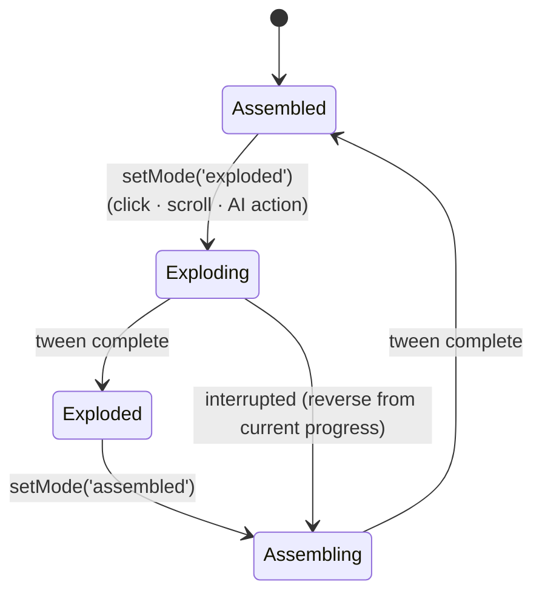

# React Three Fiber Components

Stack: `three`, `@react-three/fiber` (v9, React 19), `@react-three/drei`, `@react-three/postprocessing` (Bloom), `gsap`. All 3D code lives in `src/components/three/` and is loaded **client-only** with `next/dynamic(..., { ssr: false })` so it never blocks first paint.

## 1. Component tree



## 2. `<SceneCanvas>` — wrapper

```tsx
interface SceneCanvasProps {
  children: React.ReactNode;
  className?: string;
  /** Rendered when WebGL is unavailable or quality === 'fallback2d' */
  fallback: React.ReactNode;
  camera?: { position: [number, number, number]; fov?: number };
  interactive?: boolean;          // enables OrbitControls
  frameloop?: 'always' | 'demand'; // 'demand' for hero when offscreen
}
```

Responsibilities:
1. **WebGL detection** — `isWebGL2Available()` (from `three/examples/jsm/capabilities/WebGL.js`) in a `useEffect`; renders `fallback` if false.
2. **Visibility** — `IntersectionObserver` switches `frameloop` to `'never'` when the canvas is off-screen (saves battery on mobile).
3. **Performance** — drei `<PerformanceMonitor onDecline={stepDown} onIncline={stepUp} flipflops={3} onFallback={() => setQuality('fallback2d')}>` and `<AdaptiveDpr pixelated />`.
4. **DPR** by tier: high `[1, 2]`, medium `[1, 1.5]`, low `1`.
5. **Suspense** with a lightweight `<CanvasLoader/>` (drei `useProgress`) inside the canvas.
6. **Accessibility** — wrapper has `role="img"` + localized `aria-label`; all 3D interactions have DOM-button equivalents (Explode/Assemble toggle, node list).

Quality tiers:

| Tier | DPR | Bloom | Env map | Packets per edge | Shadows |
|------|-----|-------|---------|------------------|---------|
| high | 1–2 | ✓ (intensity 1.2) | ✓ | 24 | contact shadows |
| medium | 1–1.5 | ✓ (0.8) | ✗ | 12 | ✗ |
| low | 1 | ✗ | ✗ | 6 | ✗ |
| fallback2d | — | — | — | — | SVG diagram |

Initial tier: `low` if `navigator.hardwareConcurrency <= 4` or a coarse pointer + width < 768, else `high`.

## 3. Procedural nodes

No external GLTF models in v1 — every node is procedural geometry (tiny bundles, instant load, easy to theme).

| `kind` | Geometry | Material | Signature detail |
|--------|----------|----------|------------------|
| `trigger` | `OctahedronGeometry(0.6)` stretched on Y (diamond) | `MeshPhysicalMaterial` metalness 0.8, roughness 0.25, emissive orange | Slow Y-rotation; pulse ring on activation |
| `router` | `CylinderGeometry(0.5, 0.5, 0.9, 32)` | carbon body + emissive cyan band (`TorusGeometry`) | Output ports fan out on explode |
| `action` | `RoundedBox` (drei) 1×1×1, radius 0.08 | dark carbon with edge glow (`Edges` drei, orange) | Inner core cube visible when exploded |
| `ai` | `IcosahedronGeometry(0.6, 1)` | `MeshTransmissionMaterial` (high) / emissive wire (low) | Inner rotating wireframe "brain" |
| `storage` | 3 stacked `CylinderGeometry` discs | metallic | Discs separate vertically on explode |

```tsx
interface WorkflowNodeProps {
  node: WorkflowNodeData;              // from workflow_metadata.nodes (locale-resolved label)
  accent?: string;                     // default var(--color-accent) resolved to hex
  onSelect?: (id: string) => void;
}
```

Each node:
- Position per frame: `lerpVec(node.position, node.position + node.exploded, easeInOutCubic(explodeProgress))` computed inside `useFrame` (no React state).
- Hover → `hoverNode(id)`, cursor pointer, emissive intensity ×1.6, label scales up.
- Click → `selectNode(id)`, camera focuses node (`focusCamera`), side panel shows `n8nType`, stats.
- When exploded, the node also separates into **shell + core** sub-meshes (shell offset outward by 0.25 along view-facing normal) — the "exploded view" of the node itself.

## 4. Edges & data packets

`<WorkflowEdge from to animated />`:
- Curve: `CatmullRomCurve3` through `[start, midLifted, end]` where `midLifted` raises Y by `0.6 + 0.4 * explodeProgress` (laser arcs bend more when exploded).
- Rendering: drei `<Line>` (meshline) width 1.5, color cyan `#00E5FF`, `dashed` with animated `dashOffset` = "laser beam".
- Curve points are recomputed in `useFrame` only when `explodeProgress` changed by > 0.001.

`<DataPackets curve count speed />`:
- One `InstancedMesh` of small spheres (`SphereGeometry(0.05, 8, 8)`) per edge, additive blending, orange → cyan gradient by `t`.
- Each instance has phase offset `i / count`; position = `curve.getPointAt((time * speed + phase) % 1)`.
- Respects reduced motion: packets are static at evenly spaced points.

## 5. Exploded-view animation



`<ExplodeDriver/>`:

```tsx
useEffect(() => useSceneStore.subscribe(
  (s) => s.mode,
  (mode) => {
    tween.current?.kill();
    const target = { p: useSceneStore.getState().explodeProgress };
    tween.current = gsap.to(target, {
      p: mode === 'exploded' ? 1 : 0,
      duration: reducedMotion ? 0 : 1.4,
      ease: mode === 'exploded' ? 'expo.out' : 'power3.inOut',
      onUpdate: () => useSceneStore.getState()._setExplodeProgress(target.p),
    });
  },
), []);
```

"Physics-driven" feel: each node adds a damped spring wobble on top of the tween — `wobble = sin(t * 8 + seed) * exp(-t * 4) * 0.06` during the first 600 ms after a mode change — and staggered start (`delay = index * 0.05`).

Triggers:
- **Click** — "Explode / Assemble" toggle button (DOM) and double-click on canvas.
- **Scroll** — GSAP `ScrollTrigger` on the portfolio section: entering 60% viewport → exploded; leaving → assembled (only if the user hasn't manually toggled in this visit).
- **AI** — `trigger_3d_workflow` action via `AgentActionRunner`.

## 6. Hero `<AutomationCore/>`

Ambient centrepiece: a slowly rotating icosahedron core (orange emissive) wrapped by three orbit rings of tiny nodes (cyan points) with packets travelling along torus knots. Mouse parallax (±0.15 rad) on desktop; gyroscope disabled. Runs `frameloop="demand"` with a 30 fps throttle on `low` tier.

## 7. Labels & RTL in 3D

drei `<Text>` (troika) renders Arabic with correct shaping when given an Arabic-capable font:
- Fonts: `/fonts/IBMPlexSansArabic-Medium.woff` (ar) and `/fonts/Inter-Medium.woff` (en), passed via `font` prop based on locale.
- Props: `direction={locale === 'ar' ? 'rtl' : 'ltr'}`, `anchorX="center"`, `maxWidth={2.2}`, `sdfGlyphSize={64}`.
- Labels billboard toward the camera (drei `<Billboard>`).
- Precompute glyphs with `preloadFont` during Suspense to avoid flashes.

## 8. File layout

```
src/components/three/
├── scene-canvas.tsx
├── camera-rig.tsx
├── lighting.tsx
├── effects.tsx
├── fallback-diagram.tsx        # SVG 2D fallback using the same workflow data
├── hero/automation-core.tsx
├── workflow/
│   ├── workflow-scene.tsx
│   ├── explode-driver.tsx
│   ├── workflow-node.tsx
│   ├── nodes/{trigger,router,action,ai,storage}-node.tsx
│   ├── workflow-edge.tsx
│   ├── data-packets.tsx
│   └── node-label.tsx
└── utils/{easing,vectors,quality}.ts
```

## 9. Performance budget

| Metric | Target |
|--------|--------|
| 3D JS chunk (gzipped) | ≤ 250 KB (three tree-shaken, drei per-import) |
| Draw calls (portfolio scene) | ≤ 60 |
| Mobile frame time (mid-range Android) | ≤ 22 ms (≥ 45 fps) on `low` |
| LCP impact | none — canvas hydrates after LCP; poster image shown first |
