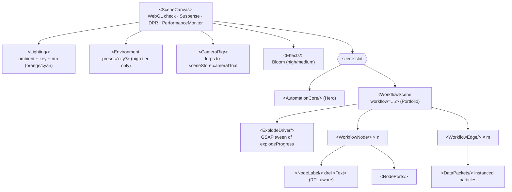
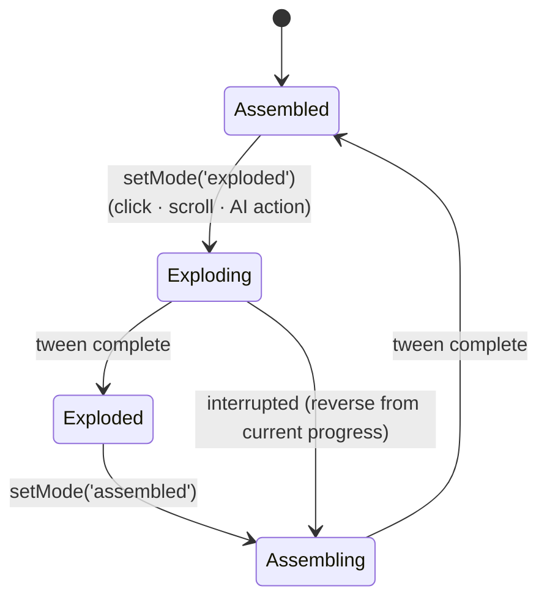

# React Three Fiber Components

Stack: `three`, `@react-three/fiber` (v9, React 19), `@react-three/drei`, `@react-three/postprocessing` (Bloom), `gsap`. All 3D code lives in `src/components/three/` and is loaded **client-only** with `next/dynamic(..., { ssr: false })` so it never blocks first paint.

## 1. Component tree



## 2. `<SceneCanvas>` — wrapper

```tsx
interface SceneCanvasProps {
  children: React.ReactNode;
  className?: string;
  /** Rendered when WebGL is unavailable or quality === 'fallback2d' */
  fallback: React.ReactNode;
  camera?: { position: [number, number, number]; fov?: number };
  interactive?: boolean;          // enables OrbitControls
  frameloop?: 'always' | 'demand'; // 'demand' for hero when offscreen
}
```

Responsibilities:
1. **WebGL detection** — `isWebGL2Available()` (from `three/examples/jsm/capabilities/WebGL.js`) in a `useEffect`; renders `fallback` if false.
2. **Visibility** — `IntersectionObserver` switches `frameloop` to `'never'` when the canvas is off-screen (saves battery on mobile).
3. **Performance** — drei `<PerformanceMonitor onDecline={stepDown} onIncline={stepUp} flipflops={3} onFallback={() => setQuality('fallback2d')}>` and `<AdaptiveDpr pixelated />`.
4. **DPR** by tier: high `[1, 2]`, medium `[1, 1.5]`, low `1`.
5. **Suspense** with a lightweight `<CanvasLoader/>` (drei `useProgress`) inside the canvas.
6. **Accessibility** — wrapper has `role="img"` + localized `aria-label`; all 3D interactions have DOM-button equivalents (Explode/Assemble toggle, node list).

Quality tiers:

| Tier | DPR | Bloom | Env map | Packets per edge | Shadows |
|------|-----|-------|---------|------------------|---------|
| high | 1–2 | ✓ (intensity 1.2) | ✓ | 24 | contact shadows |
| medium | 1–1.5 | ✓ (0.8) | ✗ | 12 | ✗ |
| low | 1 | ✗ | ✗ | 6 | ✗ |
| fallback2d | — | — | — | — | SVG diagram |

Initial tier: `low` if `navigator.hardwareConcurrency <= 4` or a coarse pointer + width < 768, else `high`.

## 3. Procedural nodes

No external GLTF models in v1 — every node is procedural geometry (tiny bundles, instant load, easy to theme).

| `kind` | Geometry | Material | Signature detail |
|--------|----------|----------|------------------|
| `trigger` | `OctahedronGeometry(0.6)` stretched on Y (diamond) | `MeshPhysicalMaterial` metalness 0.8, roughness 0.25, emissive orange | Slow Y-rotation; pulse ring on activation |
| `router` | `CylinderGeometry(0.5, 0.5, 0.9, 32)` | carbon body + emissive cyan band (`TorusGeometry`) | Output ports fan out on explode |
| `action` | `RoundedBox` (drei) 1×1×1, radius 0.08 | dark carbon with edge glow (`Edges` drei, orange) | Inner core cube visible when exploded |
| `ai` | `IcosahedronGeometry(0.6, 1)` | `MeshTransmissionMaterial` (high) / emissive wire (low) | Inner rotating wireframe "brain" |
| `storage` | 3 stacked `CylinderGeometry` discs | metallic | Discs separate vertically on explode |

```tsx
interface WorkflowNodeProps {
  node: WorkflowNodeData;              // from workflow_metadata.nodes (locale-resolved label)
  accent?: string;                     // default var(--color-accent) resolved to hex
  onSelect?: (id: string) => void;
}
```

Each node:
- Position per frame: `lerpVec(node.position, node.position + node.exploded, easeInOutCubic(explodeProgress))` computed inside `useFrame` (no React state).
- Hover → `hoverNode(id)`, cursor pointer, emissive intensity ×1.6, label scales up.
- Click → `selectNode(id)`, camera focuses node (`focusCamera`), side panel shows `n8nType`, stats.
- When exploded, the node also separates into **shell + core** sub-meshes (shell offset outward by 0.25 along view-facing normal) — the "exploded view" of the node itself.

## 4. Edges & data packets

`<WorkflowEdge from to animated />`:
- Curve: `CatmullRomCurve3` through `[start, midLifted, end]` where `midLifted` raises Y by `0.6 + 0.4 * explodeProgress` (laser arcs bend more when exploded).
- Rendering: drei `<Line>` (meshline) width 1.5, color cyan `#00E5FF`, `dashed` with animated `dashOffset` = "laser beam".
- Curve points are recomputed in `useFrame` only when `explodeProgress` changed by > 0.001.

`<DataPackets curve count speed />`:
- One `InstancedMesh` of small spheres (`SphereGeometry(0.05, 8, 8)`) per edge, additive blending, orange → cyan gradient by `t`.
- Each instance has phase offset `i / count`; position = `curve.getPointAt((time * speed + phase) % 1)`.
- Respects reduced motion: packets are static at evenly spaced points.

## 5. Exploded-view animation



`<ExplodeDriver/>`:

```tsx
useEffect(() => useSceneStore.subscribe(
  (s) => s.mode,
  (mode) => {
    tween.current?.kill();
    const target = { p: useSceneStore.getState().explodeProgress };
    tween.current = gsap.to(target, {
      p: mode === 'exploded' ? 1 : 0,
      duration: reducedMotion ? 0 : 1.4,
      ease: mode === 'exploded' ? 'expo.out' : 'power3.inOut',
      onUpdate: () => useSceneStore.getState()._setExplodeProgress(target.p),
    });
  },
), []);
```

"Physics-driven" feel: each node adds a damped spring wobble on top of the tween — `wobble = sin(t * 8 + seed) * exp(-t * 4) * 0.06` during the first 600 ms after a mode change — and staggered start (`delay = index * 0.05`).

Triggers:
- **Click** — "Explode / Assemble" toggle button (DOM) and double-click on canvas.
- **Scroll** — GSAP `ScrollTrigger` on the portfolio section: entering 60% viewport → exploded; leaving → assembled (only if the user hasn't manually toggled in this visit).
- **AI** — `trigger_3d_workflow` action via `AgentActionRunner`.

## 6. Hero `<AutomationCore/>`

Ambient centrepiece: a slowly rotating icosahedron core (orange emissive) wrapped by three orbit rings of tiny nodes (cyan points) with packets travelling along torus knots. Mouse parallax (±0.15 rad) on desktop; gyroscope disabled. Runs `frameloop="demand"` with a 30 fps throttle on `low` tier.

## 7. Labels & RTL in 3D

drei `<Text>` (troika) renders Arabic with correct shaping when given an Arabic-capable font:
- Fonts: `/fonts/IBMPlexSansArabic-Medium.woff` (ar) and `/fonts/Inter-Medium.woff` (en), passed via `font` prop based on locale.
- Props: `direction={locale === 'ar' ? 'rtl' : 'ltr'}`, `anchorX="center"`, `maxWidth={2.2}`, `sdfGlyphSize={64}`.
- Labels billboard toward the camera (drei `<Billboard>`).
- Precompute glyphs with `preloadFont` during Suspense to avoid flashes.

## 8. File layout

```
src/components/three/
├── scene-canvas.tsx
├── camera-rig.tsx
├── lighting.tsx
├── effects.tsx
├── fallback-diagram.tsx        # SVG 2D fallback using the same workflow data
├── hero/automation-core.tsx
├── workflow/
│   ├── workflow-scene.tsx
│   ├── explode-driver.tsx
│   ├── workflow-node.tsx
│   ├── nodes/{trigger,router,action,ai,storage}-node.tsx
│   ├── workflow-edge.tsx
│   ├── data-packets.tsx
│   └── node-label.tsx
└── utils/{easing,vectors,quality}.ts
```

## 9. Performance budget

| Metric | Target |
|--------|--------|
| 3D JS chunk (gzipped) | ≤ 250 KB (three tree-shaken, drei per-import) |
| Draw calls (portfolio scene) | ≤ 60 |
| Mobile frame time (mid-range Android) | ≤ 22 ms (≥ 45 fps) on `low` |
| LCP impact | none — canvas hydrates after LCP; poster image shown first |

## 10. As built (Phase 5)

Where this section differs from §1–§9, this section wins (ADR-015/016/017).

```
src/components/three/
├── scene-canvas.tsx          # Canvas wrapper: frameloop "never" off-screen, DPR/AA by tier, PerformanceMonitor,
│                             # context-loss + error-boundary → 2D fallback, first-frame onReady
├── lighting.tsx              # ambient + key + orange/cyan rims + procedural <Environment> (Lightformers, no HDR download)
├── effects.tsx               # lazy Bloom (luminanceThreshold 1 → only HDR glow parts bloom); high/medium + dark only
├── hero/automation-core.tsx  # hero centrepiece (transparent canvas, halo sprites instead of post-processing)
├── workflow/
│   ├── workflow-canvas.tsx   # default export, loaded with next/dynamic({ ssr: false })
│   ├── workflow-sim.ts       # per-node springs, hover "peek", live positions (pure, unit-tested)
│   ├── workflow-node.tsx     # positions a node per frame, hover/select → scene store, projects its label
│   ├── node-meshes.tsx       # trigger · router · action · ai · storage (shell + core explode)
│   ├── workflow-edge.tsx     # dashed fat line ("laser"), port sockets, instanced packets (orange → cyan)
│   ├── camera-rig.tsx        # glides to the fitted overview / selected node; OrbitControls on fine pointers only
│   └── label-layer.tsx       # single DOM label layer (ADR-016)
└── utils/{spring,quality,camera,edge,textures}.ts
src/components/portfolio/     # DOM side: WorkflowStage, WorkflowDiagram2D (poster + fallback), WorkflowSteps, useScrollExplode
src/lib/hooks/                # useMediaQuery/useReducedMotion/useFinePointer, useSceneSupport/useIdle/useNearViewport
src/lib/theme/palette.ts      # TS mirror of the colour tokens for Three.js
```

**Explode/assemble triggers.** All four drive one value: `sceneStore.mode`.
- *Click*: the Explode/Assemble button, or a double-click on the canvas.
- *Scroll*: at ≥ 60 % in view the workflow explodes after 650 ms, and reassembles once fully out of view. It replays on a project switch, and stops for the visit once the visitor or the agent sets a mode.
- *Hover*: the node "peeks", opening its own shell and core. This also works on the 2D diagram and the step list.
- *AI*: `trigger_3d_workflow` → `setMode(mode, "agent")`.

**Exploded view** works at two levels:
- The workflow spreads nodes along `position + exploded × spring`.
- Each node splits its own geometry: trigger cage, router band and fins, action lid and base around a glowing core, AI glass shell and brain, storage platters.

**Quality tiers** (`utils/quality.ts`):

| Tier | DPR | Bloom | MSAA | Packets / edge | AI glass |
|------|-----|-------|------|----------------|----------|
| high | 1–2 | 1.15 | 4 | 24 | transmission |
| medium | 1–1.5 | 0.8 | — | 12 | translucent |
| low | 1 | — | — | 6 | translucent |
| fallback2d | — | — | — | — | SVG/DOM diagram |

- **Initial tier:**
  - `low`: data-saver, ≤ 4 cores, ≤ 4 GB memory, or a phone (coarse pointer under 768 px)
  - `medium`: a tablet or ≤ 6 cores
  - `high`: everything else
- **At runtime:** drei `PerformanceMonitor` steps the tier between high and low. Its `onFallback` switches to 2D unless the visitor pinned 3D with the 2D/3D switch.

**Resilience.** Each failure case and what happens:

| Situation | Result |
|---|---|
| No WebGL | 2D diagram plus a notice |
| Render error | Error boundary → 2D |
| First WebGL context loss | 2D, then one automatic remount after 1.5 s (`renderAttempt` keys the canvas) |
| Second context loss | Stays in 2D |
| Off-screen | `frameloop="never"` |
| Reduced motion | Instant transitions, static packets, no sway or parallax, camera snaps |
| Touch devices | No OrbitControls, so the page keeps scrolling natively |

**Bundle** (production build): three.js, R3F and drei are absent from the initial JS. The lazy 3D core is about 232 KB gzipped, plus about 8 KB per scene; Bloom is a separate ~21 KB chunk.

**RTL**: `localizeWorkflow()` mirrors X, so Arabic workflows flow right → left. Labels are DOM text with `dir="auto"`, so Arabic shapes correctly.

## 11. As built (visual overhaul, 2026-10-09)

Supersedes §10 where they differ (ADR-020/021/022).

```
src/components/stage/
├── stage-root.tsx          # mounts the stage on idle when WebGL + a 3D tier; context-loss remount
├── stage-slot.tsx          # DOM placeholder + 2D poster; lazy-loads its scene while near the viewport
└── stage-focus-bridge.tsx  # data-focus-service / data-focus-member hover+focus → ui store
src/components/three/
├── stage/
│   ├── stage-canvas.tsx    # THE canvas: fixed, transparent, behind the page; View.Port + PerformanceMonitor
│   ├── stage-view.tsx      # <View> + own camera, studio lights, 64px Lightformer env; useSectionProgress()
│   └── conduit-scene.tsx   # full-viewport ortho view: page-length data conduits, scroll-energised
├── hardware/
│   ├── parts.tsx           # chamferedBox() geometry, Chassis, AcrylicCover, Pcb, Pins, Led, Halo
│   ├── hardware-node.tsx   # n8n node: chassis / PCB / acrylic cover layers, I/O pins, decal, LEDs
│   ├── cable.tsx           # tube patch cable (sheath + glowing conductor) with instanced packets
│   ├── textures.ts         # canvas textures: PCB traces, cover decal, rack panel, profile chip (cached)
│   └── decal-text.ts       # n8n type → integration name, port counts, monograms (unit-tested)
├── scenes/                 # one lazy chunk per vignette
│   ├── hero-switch.tsx     # high-voltage knife switch → closes on scroll/click, arcs, powers conduits
│   ├── server-rack.tsx     # services: blades slide out staggered on scroll; hovered service pulls further
│   ├── neural-core.tsx     # team: profile chips emerge from a neural core; hovered member comes forward
│   └── node-terminal.tsx   # booking: chosen service cartridge snaps into the pipeline; sockets per step
└── workflow/               # portfolio view: WorkflowSim + hardware nodes + cables (+ DOM label layer)
src/lib/stage/progress.ts   # travelProgress, staggered, snapEase, smoothstep (unit-tested)
```

**Rendering model.** `StageCanvas` sits fixed behind the content (`z-index:-1`; the body background propagates to the root canvas, so it stays visible). Each scene is a drei `View` laid over its DOM slot:
- Views render in `index` order: conduits (1), hero (2), rack (3), portfolio (4), team (5), terminal (6).
- Views clip to their slot and are skipped when off-screen.
- Sections stay transparent where a view shows. The portfolio stage drops its surface tint while 3D is live.
- Pointer events reach a view through its DOM element. Labels and overlays are `pointer-events:none`.

**Scrollytelling.**
- `useSectionProgress(id)` gives each scene its section's travel through the viewport, from 0 (entering) to 1 (leaving), updated every frame without re-rendering.
- The rack and the neural core use `staggered()` + `snapEase()`, so parts slide out one after another and click into place.
- The portfolio keeps the spring simulation. Its overshoot below 0 on assemble presses the layers together: the "snap back into execution".
- **Conduits:** the path is a centripetal Catmull-Rom curve in CSS pixels through every `[data-stage-anchor]`, running down the outer gutter (left in RTL). It is rebuilt on resize or layout change.
- **Energy:** once the hero switch is closed (scroll > 40 px or a click, `sceneStore.powered`), the lit tube's `drawRange` grows to just below the fold and packets ride the lit part.

**Hardware node explode layers** (`separation` from 0 to ~1, may overshoot):

| Part | Movement as the node explodes |
|---|---|
| Chassis | drops 0.32 |
| PCB | rises 0.42 |
| Acrylic cover with decal | rises 0.95 and tilts |
| Pins | slide outward |
| Trigger lever | flips |
| AI / router core | spins up |

Cables plug into the pin tips (`PIN_REACH`). Tube geometry is rebuilt only when an end moves.

**Fallbacks.** Any of these keeps the 2D posters, and `fallbackReason` drives the portfolio notice:
- no WebGL
- the `fallback2d` tier (the visitor's switch or sustained low FPS)
- a stage render error
- a second context loss (the first remounts the stage once)

`StageSlot` reserves its layout box, so swapping between poster and 3D never shifts the page.

**Budget.** No downloaded assets. The 3D JavaScript is ~243 KB gzipped, lazy (three + R3F + drei ~234 KB, plus small scene chunks). The initial page JS is ~313 KB gzipped.

**Verification status.** Unit tests cover progress maths, conduit routing, decals and the simulation (77 frontend tests pass); typecheck, lint and the production build pass. **These scenes have not yet been inspected visually in a browser.** Check them on the next run with a visible browser: dark/light, ar/en, 375–1440 px.

## 12. n8n look and real icons (2026-10-09, ADR-023)

- **Icon registry:** `src/lib/integrations/index.ts` maps an n8n node type to an icon:
  - official brand marks from simple-icons, e.g. `n8n-nodes-base.whatsApp` → WhatsApp, `lmChatGoogleGemini` → Gemini
  - n8n core glyphs (`core-icons.ts`, generated from lucide data): Webhook, IF/Switch, Filter, Code, Form, Agent, LLM Chain…

  Unknown types fall back by node kind. The same icon renders as inline SVG (`IntegrationIcon`) and on canvas textures (`drawIcon`). `displayColor()` lifts brand colours that would vanish on the current theme.
- **Portfolio, 2D** (`portfolio/n8n-node.tsx`, `workflow-diagram-2d.tsx`): drawn like the n8n canvas.
  - Dotted background; nodes are rounded squares (triggers use the "D" shape with the orange lightning marker).
  - Grey handles, with routers fanning out to at least 2 outputs.
  - A green "executed" border and check badge on every node.
  - Bezier connections leave and enter handles horizontally, with arrowheads, branch labels (`fromPort`) and flowing green dashes.
  - Labels show the node name with the integration as a subtitle.
- **Portfolio, 3D** (`hardware/n8n-tile.tsx`): the same node as a tile.
  - Parts: an extruded body (rounded square or D), a green border ring, and a face plate carrying the real icon and check badge, plus handle spheres and the lightning marker.
  - On explode the face plate moves forward, the border ring moves out and the body moves back; the handles slide out; the spring's overshoot snaps the layers together on assemble.
  - Connections use `Cable variant="n8n"`: a thin grey line with no sag and a cone arrowhead that turns green on hover or selection, carrying green data packets.
- **Hero** (`scenes/n8n-logo.tsx`): the official n8n mark built from its SVG path (`SVGLoader` → bevelled `ExtrudeGeometry`).
  - On load it extrudes out of the page and swings into place (spring), then floats and leans toward the pointer.
  - Once powered (scroll or click), pulses run trigger → hub → both branches and the ring holes light up as they arrive.
  - The logo is never mirrored in RTL.
  - Poster: the flat n8n SVG with a glow.
- **Rack blades and the booking cartridge** show the service's real mark on a light badge (`panelTexture(…, icon)`).
- **Budget:** 13 brand icons bundled (+~10 KB initial JS, 323 KB gzip); the lazy 3D is ~252 KB gzip including `SVGLoader`.
- **Verification status:** unit tests cover icon mapping, colour lifting, subtitles, handle counts and connection paths (81 frontend tests); typecheck, lint and the production build pass. **Not yet inspected in a visible browser.**

### 12.1 AI sub-nodes and the recruitment pipeline (2026-10-09)

- **Edge `type`:** edges can carry `type: "ai"` for an AI sub-node (model, memory or tool) attached to its agent or chain. The backend keeps the field only when it isn't the default `main`; the admin edge editor gained a "Connection" select; workflows may have up to 24 nodes.
- **Rendering**, in both 2D and 3D:
  - Sub-nodes are round, with n8n's diamond handle on top.
  - Attachments run dashed (2D) or as thin vertical lines (3D) from the sub-node's top up into the agent's bottom, with no arrowhead and no packets.
  - Handle counts and branch ports ignore attachments.
- **Wide workflows:** below `MIN_UNIT` (26 px per scene unit) the 2D canvas stops shrinking and scrolls sideways, like panning in n8n; labels narrow and wrap when nodes are dense. The 3D view fits the whole workflow (`fitCamera`), and its labels wrap at 7.5 rem.
- **Step list** (`orderedNodes`): a depth-first walk of the data connections that covers every branch, with each sub-node listed right after the node it serves.
- **Project 4 — `ai-recruitment-pipeline`:** a compact 16-node version of the client's real n8n recruitment workflow.
  - **Intake:** Form Trigger → Extract PDF → Sheets (find candidate) → IF "already applied" (true → a form page).
  - **Scoring:** a Basic LLM Chain with Gemini scores the CV → IF score ≥ 70.
  - **Score ≥ 70:** an AI Agent with Gemini and memory → Check Calendar → Create Meet & Event → Gmail acceptance.
  - **Below 70:** Sheets (rejected) → Gmail rejection.

  It has a bilingual case study in the knowledge base, so the Copilot can describe it and `trigger_3d_workflow` can show it.
