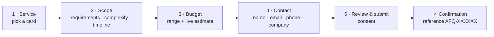

# Feature: Service Request Booking Engine

## 1. Goal

Convert visitors into qualified leads with a short, guided, bilingual multi-step form that shows an **instant estimate**, persists to Laravel, and notifies the team through n8n. The AI agent can create the same request conversationally.

## 2. Steps



| Step | Fields | Client validation (zod) |
|------|--------|--------------------------|
| 1 Service | `service_slug` (or "Not sure — advise me") | optional enum of loaded slugs |
| 2 Scope | `requirements` (textarea), `complexity` 1–5 slider, `timeline` | requirements 20–5000 chars |
| 3 Budget | `budget_range` radio cards | required enum |
| 4 Contact | `client_name`, `client_email`, `client_phone` (intl input), `company` | name 2–120, RFC email, E.164 phone |
| 5 Review | summary + `consent` checkbox + hidden honeypot `website` | consent true |

- Built with `react-hook-form` + `zodResolver`; one form instance across steps, per-step `trigger()` before advancing.
- Progress bar with step labels; back navigation keeps values; draft auto-saved to `sessionStorage`.
- Prefill: `useUiStore.bookingPrefill` (set from a service card's "Request this" button or from the AI agent) jumps to step 2 with the service selected.
- Server errors (`422`) are mapped back to fields and the form jumps to the first step containing an error.

## 3. Estimate rules (`EstimateCalculator`)

Shared by `POST /service-requests/estimate` (live, debounced 400 ms) and persisted on creation.

```
base      = service.starting_price ?? 1500           (USD)
cx_factor = [1: 0.8, 2: 1.0, 3: 1.4, 4: 2.0, 5: 3.0][complexity ?? 3]
tl_factor = [asap: 1.25, 1_month: 1.1, 1_3_months: 1.0, flexible: 0.95][timeline ?? 1_3_months]

mid  = base * cx_factor * tl_factor
min  = round_to_50(mid * 0.85)
max  = round_to_50(mid * 1.30)
weeks = [ceil(2 * cx_factor), ceil(3.5 * cx_factor)]
```

If the computed range sits entirely above the selected `budget_range`, the UI shows a gentle notice ("Your budget may cover a phased MVP — we'll suggest options"). Estimates are explicitly labeled **indicative**.

Seeded `starting_price`: Custom n8n Nodes 1500 · AI Voice & Chat Agents 3000 · CRM Sync 2000 · WhatsApp Business Automation 1800 · E-commerce Logistics Routing 2500.

## 4. Backend flow

```php
// ServiceRequestController@store
public function store(StoreServiceRequestRequest $request, CreateServiceRequest $create): JsonResponse
{
    $serviceRequest = $create(ServiceRequestData::fromRequest($request), source: RequestSource::WebForm);
    return ServiceRequestCreatedResource::make($serviceRequest)->response()->setStatusCode(201);
}
```

`CreateServiceRequest` action (shared with the AI tool):
1. Duplicate guard: same `client_email` + `service_id` within 10 minutes → `409 CONFLICT` (AI tool returns the existing reference instead).
2. Normalize phone (E.164) and email (lowercase).
3. Compute estimate via `EstimateCalculator`.
4. Generate `reference` = `AFQ-` + 6 chars from Crockford base32 (no ambiguous chars), retry on collision.
5. `DB::transaction` → insert with `status = new`, `metadata = {locale, utm, ip_hash}`.
6. `NotifyN8nOfInquiry::dispatch($id)->afterCommit()`.
7. Fire `ServiceRequestCreated` event (Filament database notification to admins).

## 5. n8n webhook payload

`NotifyN8nOfInquiry` POSTs to `N8N_WEBHOOK_URL`:

```json
{
  "event": "service_request.created",
  "id": 57,
  "reference": "AFQ-7K2M9P",
  "created_at": "2026-10-08T12:30:11Z",
  "source": "web_form",
  "locale": "ar",
  "client": { "name": "Sara Al-Qahtani", "email": "sara@example.com", "phone": "+966500000000", "company": "Qimma Logistics" },
  "service": { "slug": "whatsapp-business-automation", "title": "WhatsApp Business Automation" },
  "budget_range": "5k_15k",
  "timeline": "1_3_months",
  "requirements": "…",
  "estimate": { "min": 2500, "max": 4000, "currency": "USD" },
  "admin_url": "https://dashboard.afaqn8n.me/admin/service-requests/57"
}
```

Headers: `X-Afaq-Signature: sha256=<hex HMAC of raw body with N8N_WEBHOOK_SECRET>`, `X-Afaq-Event`, `X-Afaq-Delivery` (uuid). Job: `tries = 3`, `backoff = [10, 60, 300]`, `timeout = 15`; failures recorded in `metadata.n8n.attempts` and visible in the admin.

## 6. Confirmation UX

- Success screen with reference (copy button), estimate recap, "what happens next" (3-step timeline: review within 24 h → discovery call → proposal), and WhatsApp/Email contact links.
- Fires `service_inquiry_submitted`-style confetti (reduced-motion aware).

## 7. Status lifecycle (admin)

`new` → `contacted` → `qualified` → `won` | `lost`. Transitions are free-form in v1 but each change is logged in `metadata.history[] = {from, to, by, at}`.

## 8. Tests

- Pest: happy path 201 + job dispatched (`Queue::fake()`), estimate persisted.
- Pest: validation matrix (each rule), honeypot, duplicate 409, throttle `5/min` → 429.
- Pest: `EstimateCalculator` table-driven unit tests.
- Pest: `NotifyN8nOfInquiry` signs payload correctly (`Http::fake()` + assert header), retries on 500.
- Playwright: complete the 5 steps in `ar` and `en`; server error mapping returns to step 4 for a bad email.

## 9. As built (Phase 6)

```
src/lib/booking/schema.ts            # zod schema (mirrors the API rules), steps → fields, payload + UTM helpers
src/components/booking/
├── booking-form.tsx                 # one RHF instance, 5 steps, draft, prefill, submit + problem mapping
├── booking-steps.tsx                # Service · Scope · Budget · Contact · Review (+ honeypot)
├── estimate-card.tsx                # live indicative estimate (+ "budget may cover an MVP" notice)
├── use-live-estimate.ts             # POST /service-requests/estimate, 400 ms debounce, aborts stale requests
└── booking-success.tsx              # reference + copy, estimate recap, what happens next
```

- **Steps:** Service → Scope (requirements ≥ 20 chars, complexity 1–5, timeline) → Budget → Contact → Review + consent. Each step is validated with `trigger(fields)` before advancing; the progress bar lets you jump back to any reached step, and Review has per-row **Edit**.
- **Live estimate:** shown in a sticky side summary on large screens and inside the Budget step on small ones.
- **Draft:** answers (never consent or the honeypot) are saved to `sessionStorage` (`afaq-booking-draft`) and restored with a notice; cleared on success.
- **Prefill:** "Request this service" on a card (or `useUiStore.prefillBooking`) selects the service and jumps to Scope.
- **Errors:**
  - `422`: field messages are set on the fields and the form jumps to the first step that owns one.
  - `409`: shows the existing reference.
  - `429`: shows the wait time.
  - Network errors: the answers are kept.
- **UTM:** `utm_source/medium/campaign` from the landing URL are sent as `utm`.
- **Verified live (2026-10-09):** a QA submission (`qa.test.lead@example.com`) created `AFQ-JB720N` (`web_form`, estimate $2,150–$3,300, 3–5 weeks). `NotifyN8nOfInquiry` ran and skipped because `N8N_WEBHOOK_URL` is empty locally.
