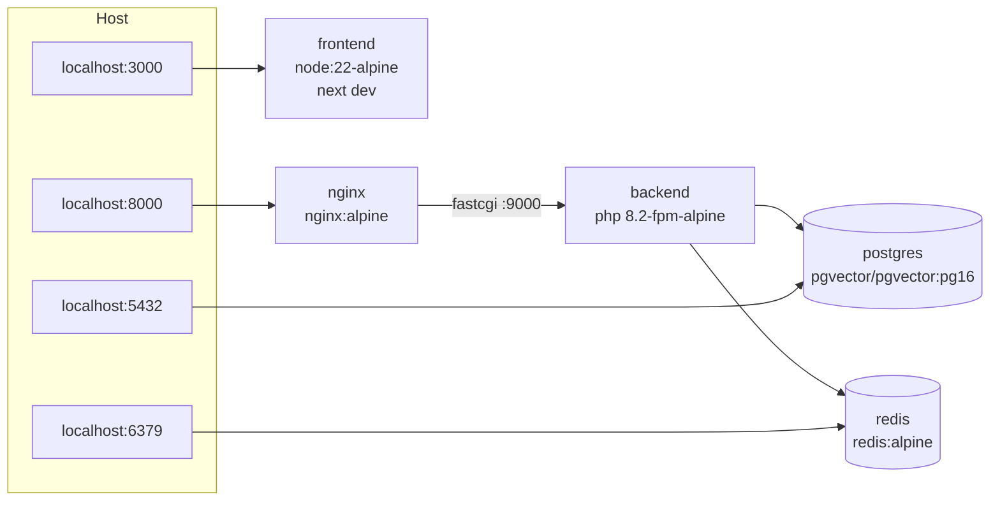

# Deployment & Docker

## 1. Development stack (`docker-compose.yml`)



| Service | Build / image | Mounts | Healthcheck |
|---------|---------------|--------|-------------|
| `postgres` | `pgvector/pgvector:pg16` | `pgdata` volume, `docker/postgres/init.sql` → `/docker-entrypoint-initdb.d/` | `pg_isready -U $POSTGRES_USER -d $POSTGRES_DB` |
| `redis` | `redis:alpine` (`--appendonly yes`) | `redisdata` volume | `redis-cli ping` |
| `backend` | `docker/backend/Dockerfile` target `dev` | `./backend:/var/www/html` + named volumes `backend_vendor` → `vendor/`, `backend_framework` → `storage/framework/`, `composer_cache` | `vendor/autoload.php` present && `php-fpm -t` |
| `queue` | same image as `backend` | same as `backend` | — (`php artisan queue:work redis --tries=3 --timeout=600`) |
| `nginx` | `nginx:alpine` | `./backend/public` (ro), `docker/nginx/default.conf` | `wget -qO- http://localhost/up` |
| `frontend` | `node:22-alpine` | `./frontend:/app`, anonymous volume `/app/node_modules` | `wget -qO- http://localhost:3000` |

`init.sql` creates the `vector` extension in the main DB and creates `afaq_testing` (with the extension) for Pest.

### Common commands

```bash
cp .env.example .env                       # compose-level vars (ports, DB creds)
cp backend/.env.example backend/.env       # Laravel vars
docker compose up -d --build               # first start runs composer install into the vendor volume
docker compose exec backend php artisan key:generate
docker compose exec backend php artisan migrate --seed   # demo content + admin user
docker compose exec backend php artisan storage:link
docker compose exec backend php artisan rag:index-knowledge   # needs GEMINI_API_KEY (Phase 3)
docker compose logs -f backend nginx
```

### Recommended dev loop (Windows/macOS)

Run the **backend stack in Docker** and **Next.js on the host**: Docker Desktop bind mounts drop file events, so Fast Refresh inside the container is unreliable (the Next.js docs recommend host dev).

```bash
docker compose up -d postgres redis backend queue nginx
cd frontend && cp .env.example .env.local && npm install && npm run dev
```

The compose `frontend` service still works for an all-Docker setup: it sets `API_INTERNAL_URL=http://nginx/api/v1` for Server Components and `NEXT_WATCH_POLL_MS=1000` (Turbopack polling).

### Dev performance & permissions (Windows/macOS hosts)

- **Hot paths live in named volumes.** Bind-mounted NTFS is slow for Linux containers (listing `vendor/` took ~85 s; Laravel booted in ~30 s). `vendor/` and `storage/framework/` are therefore Docker named volumes — boot drops to ~2 s and requests to ~0.2 s. App code stays bind-mounted for live editing.
- `docker/backend/entrypoint-dev.sh` prepares those volumes on start (`composer install` when `vendor/` is empty, for the `backend` service only).
- Consequence: the host `backend/vendor/` is **not** what the app runs; run Composer via `docker compose exec backend composer …`. (A host copy can still be installed for IDE autocompletion.)
- `php.dev.ini` enables OPcache for CLI + FPM with `revalidate_freq=2` (edits appear within ~2 s).
- Dev FPM workers run as **root** (`php-fpm --allow-to-run-as-root`) because host files surface as root-owned in bind mounts; artisan and web requests therefore share one owner. The `prod` target keeps non-root `www-data`.
- If `next dev` file-watching lags, `WATCHPACK_POLLING=true` is already set; running the project inside WSL2 is faster still.

## 2. Backend image (`docker/backend/Dockerfile`)

Multi-stage:

| Stage | Base | Purpose |
|-------|------|---------|
| `base` | `php:8.2-fpm-alpine` | System libs + PHP extensions: `pdo_pgsql pgsql bcmath intl zip gd exif pcntl opcache` + `pecl redis`; Composer binary copied from `composer:2` |
| `dev` | `base` | Xdebug-ready (off by default), dev `php.ini`, runs as `www-data` with UID mapped via `UID`/`GID` build args |
| `vendor` | `base` | `composer install --no-dev --prefer-dist --optimize-autoloader` with only `composer.json/lock` copied (layer cache) |
| `prod` | `base` | App code + vendor; `php artisan config:cache route:cache view:cache event:cache filament:optimize`; `opcache.validate_timestamps=0`; non-root; `HEALTHCHECK` |

Prod also runs a **queue** container (same image, `command: php artisan queue:work redis --tries=3 --max-time=3600`) and a **scheduler** container (`php artisan schedule:work`) for `model:prune` and stale-index checks.

PHP ini (prod): `memory_limit=256M`, `upload_max_filesize=10M`, `post_max_size=12M`, `max_execution_time=90` (AI streams), `output_buffering=Off` (SSE).

## 3. nginx (`docker/nginx/default.conf`)

Key directives:

```nginx
client_max_body_size 12m;

location / { try_files $uri $uri/ /index.php?$query_string; }

location = /api/v1/ai/chat {
    fastcgi_pass backend:9000;
    include fastcgi_params;
    fastcgi_param SCRIPT_FILENAME /var/www/html/public/index.php;
    fastcgi_buffering off;          # SSE
    fastcgi_read_timeout 90s;
}

location ~ \.php$ {
    fastcgi_pass backend:9000;
    fastcgi_param SCRIPT_FILENAME /var/www/html/public$fastcgi_script_name;
    include fastcgi_params;
    fastcgi_read_timeout 60s;
}

location ~* ^/storage/.*\.php$ { deny all; }
location ~ /\.(?!well-known) { deny all; }
```

## 4. Frontend image (prod)

Next.js `output: 'standalone'`:

| Stage | Base | Steps |
|-------|------|-------|
| `deps` | `node:22-alpine` | `npm ci` |
| `build` | `deps` | `NEXT_PUBLIC_API_URL` build arg → `npm run build` |
| `runner` | `node:22-alpine` | copy `.next/standalone`, `.next/static`, `public`; `USER node`; `CMD ["node", "server.js"]`; port 3000 |

## 5. Production topology

```
VPS srv800051 — host nginx (TLS: Let's Encrypt), optional Cloudflare in front
├── afaqn8n.me (+ www → apex)  → 127.0.0.1:3000 → frontend  (Next.js standalone)
└── dashboard.afaqn8n.me       → 127.0.0.1:8080 → web (nginx, public/) → backend (PHP-FPM :9000)
                                                   ├── queue      (queue:work redis)
                                                   ├── scheduler  (schedule:work)
                                                   ├── postgres   (pgvector, volume pgdata)
                                                   └── redis      (AOF, volume redisdata)
```

v1 builds images on the server (`deploy.sh`, §9). Next step: build in CI, push to GHCR, and have `deploy.sh` pull tagged images instead of building.

Backups: nightly `pg_dump` (custom format) to R2, 14-day retention; `storage/app/public` synced to R2 (or use R2 as the media disk directly).

## 6. Cloudflare rules

| Rule | Match | Setting |
|------|-------|---------|
| Cache static Next assets | `afaqn8n.me/_next/static/*` | Cache Everything, Edge TTL 1 year (immutable hashed files) |
| Cache fonts/3D assets | `afaqn8n.me/fonts/*`, `afaqn8n.me/models/*`, `*.woff2`, `*.glb`, `*.ktx2` | Cache Everything, Edge TTL 30 days, Browser TTL 7 days |
| Cache media | `dashboard.afaqn8n.me/storage/*` | Cache Everything, Edge TTL 7 days |
| Bypass API | `dashboard.afaqn8n.me/api/*` | Bypass cache (origin `Cache-Control` honored for public GETs if enabled later) |
| Bypass admin | `dashboard.afaqn8n.me/admin*`, `/livewire/*` | Bypass cache, WAF managed challenge for non-allow-listed countries (optional) |
| SSE | `dashboard.afaqn8n.me/api/v1/ai/chat` | Bypass cache; no Rocket Loader; no response buffering (Cloudflare streams `text/event-stream` by default) |
| Rate limit | `dashboard.afaqn8n.me/api/v1/ai/chat` | 20 req/min/IP → block 1 min (outer layer to Laravel's 10/min) |
| Compression | all | Brotli on |

WebGL asset optimization: procedural geometry by default; any future GLB models are Draco/Meshopt compressed with KTX2 textures (`gltf-transform optimize`), lazy-loaded via `useGLTF.preload` only when the portfolio enters the viewport.

## 7. Environment variable matrix

| Variable | Where | Dev | Prod |
|----------|-------|-----|------|
| `APP_ENV` / `APP_DEBUG` | backend | `local` / `true` | `production` / `false` |
| `APP_URL` | backend | `http://localhost:8000` | `https://dashboard.afaqn8n.me` |
| `FRONTEND_URL` | backend | `http://localhost:3000` | `https://afaqn8n.me` |
| `CORS_ALLOWED_ORIGINS` | backend | `http://localhost:3000` | `https://afaqn8n.me,https://www.afaqn8n.me` |
| `DB_*` | backend + compose | `postgres` / `afaq` / `afaq` / `secret` | secrets |
| `REDIS_HOST` | backend | `redis` | `redis` |
| `QUEUE_CONNECTION` / `CACHE_STORE` | backend | `redis` | `redis` |
| `LLM_DRIVER` / `EMBEDDING_DRIVER` | backend | `gemini` (or `fake`) | `gemini` |
| `GEMINI_API_KEY` | backend | your AI Studio key | secret |
| `GEMINI_CHAT_MODEL` / `EMBEDDING_MODEL` / `EMBEDDING_DIMENSIONS` | backend | `gemini-3.5-flash` / `gemini-embedding-2` / `768` | same |
| `OLLAMA_BASE_URL` | backend | `http://host.docker.internal:11434` | — |
| `N8N_WEBHOOK_URL` / `N8N_WEBHOOK_SECRET` | backend | test webhook / random | prod webhook / secret |
| `ADMIN_SEED_PASSWORD` | backend | dev value | unset after first deploy |
| `FILESYSTEM_DISK` | backend | `public` | `r2` |
| `NEXT_PUBLIC_API_URL` | frontend | `http://localhost:8000/api/v1` | `https://dashboard.afaqn8n.me/api/v1` |
| `NEXT_PUBLIC_SITE_URL` | frontend | `http://localhost:3000` | `https://afaqn8n.me` |

## 8. Release checklist

1. CI green (backend + frontend + E2E).
2. Images tagged with git SHA, pushed to GHCR.
3. `php artisan down --render=errors::503` (optional for migrations with locks).
4. `docker compose -f docker-compose.prod.yml pull && up -d`.
5. `php artisan migrate --force && php artisan optimize`.
6. `php artisan rag:index-knowledge` if knowledge or embedding model changed.
7. `php artisan up`; smoke test `/api/v1/health`, home page in ar/en, one AI chat turn.
8. Purge Cloudflare cache for HTML (not `_next/static`).

## 9. VPS deployment runbook (`deploy.sh`)

Server: `misleem@srv800051`, checkout at `/var/www/afaq/afaqn8n` (Ubuntu, Docker Engine + compose plugin, host nginx).

| File | Purpose |
|------|---------|
| `docker-compose.prod.yml` | Prod stack; only `web` (`127.0.0.1:${WEB_PORT:-8080}`) and `frontend` (`127.0.0.1:${FRONTEND_PORT:-3000}`) publish ports |
| `docker/backend/Dockerfile` targets `prod` + `web` | FPM image (`entrypoint-prod.sh` builds Laravel/Filament caches from the mounted `.env`) and nginx image with `public/` (Filament assets) baked in |
| `docker/nginx/prod.conf` | nginx inside `web`: FastCGI to `backend:9000`, SSE location unbuffered, `/storage` from the shared volume |
| `frontend/Dockerfile` | Next.js `output: "standalone"` image |
| `deploy/nginx/*.conf`, `deploy/nginx/snippets/*` | Host nginx sites (TLS, redirects, SSE) |
| `.env.production.example`, `backend/.env.production.example` | Templates for the server's `.env` and `backend/.env` |

### 9.1 One-time server setup

```bash
# Docker Engine + compose plugin (skip if installed)
curl -fsSL https://get.docker.com | sudo sh
sudo usermod -aG docker misleem            # log out and back in afterwards

sudo apt-get install -y nginx certbot git
sudo mkdir -p /var/www/afaq /var/www/letsencrypt
sudo chown misleem:misleem /var/www/afaq

cd /var/www/afaq
git clone https://github.com/<owner>/<repo>.git afaqn8n    # or the SSH URL with a deploy key
cd afaqn8n
cp .env.production.example .env                      # set POSTGRES_PASSWORD
cp backend/.env.production.example backend/.env      # DB_PASSWORD (same), GEMINI_API_KEY, N8N_*, MAIL_*, ADMIN_SEED_PASSWORD
chmod 600 .env backend/.env
chmod +x deploy.sh

# APP_KEY: build once, print a key, paste it into backend/.env
docker compose -f docker-compose.prod.yml build backend
docker compose -f docker-compose.prod.yml run --rm --no-deps -e AFAQ_OPTIMIZE=0 backend php artisan key:generate --show
```

DNS: `A`/`AAAA` records for `afaqn8n.me`, `www.afaqn8n.me` and `dashboard.afaqn8n.me` → the VPS. If Cloudflare proxies them, set SSL mode **Full (strict)**. Issue the certificates first with the records **DNS only** (grey cloud), or keep the HTTP-01 webroot reachable.

### 9.2 TLS certificates (certbot, webroot)

The site configs reference certificate files, so nginx refuses to load them before the first issue. Bootstrap with the port-80-only config, then switch:

```bash
sudo cp deploy/nginx/acme-bootstrap.conf /etc/nginx/sites-available/afaq-acme.conf
sudo ln -sf /etc/nginx/sites-available/afaq-acme.conf /etc/nginx/sites-enabled/
sudo nginx -t && sudo systemctl reload nginx

sudo certbot certonly --webroot -w /var/www/letsencrypt \
  -d afaqn8n.me -d www.afaqn8n.me \
  --email info@afaqn8n.me --agree-tos --no-eff-email
sudo certbot certonly --webroot -w /var/www/letsencrypt \
  -d dashboard.afaqn8n.me \
  --email info@afaqn8n.me --agree-tos --no-eff-email

sudo rm /etc/nginx/sites-enabled/afaq-acme.conf
```

Renewal: the certbot package installs a systemd timer. Reload nginx after each renewal and dry-run once:

```bash
echo -e '#!/bin/sh\nsystemctl reload nginx' | sudo tee /etc/letsencrypt/renewal-hooks/deploy/reload-nginx.sh
sudo chmod +x /etc/letsencrypt/renewal-hooks/deploy/reload-nginx.sh
sudo certbot renew --dry-run
```

### 9.3 Host nginx sites

```bash
sudo cp deploy/nginx/snippets/afaq-ssl.conf deploy/nginx/snippets/afaq-proxy.conf /etc/nginx/snippets/
sudo cp deploy/nginx/afaqn8n.me.conf deploy/nginx/dashboard.afaqn8n.me.conf /etc/nginx/sites-available/
sudo ln -sf /etc/nginx/sites-available/afaqn8n.me.conf /etc/nginx/sites-enabled/
sudo ln -sf /etc/nginx/sites-available/dashboard.afaqn8n.me.conf /etc/nginx/sites-enabled/
sudo nginx -t && sudo systemctl reload nginx
```

If `WEB_PORT`/`FRONTEND_PORT` in `.env` aren't 8080/3000, change the `upstream` blocks to match. The SSE location (`/api/v1/ai/chat`) turns off `proxy_buffering`, `proxy_request_buffering`, `proxy_cache` and gzip and raises the read timeout to 120 s; the stack's nginx does the same for FastCGI, and Laravel also sends `X-Accel-Buffering: no`. Both configs pass `nginx -t` on nginx 1.18 and 1.24 (Ubuntu 22.04 and 24.04).

### 9.4 Deploying

```bash
./deploy.sh --seed     # first deploy: migrate + seed content/admin + index the knowledge base
./deploy.sh            # every later deploy
./deploy.sh --reindex  # also re-embed changed knowledge chunks
```

Each run takes a lock, checks the env files, fast-forwards `main`, builds `backend`/`web`, starts postgres+redis, writes a `pg_dump -Fc` to `$BACKUP_DIR` (keeps the newest 14), runs `migrate --force`, restarts backend/queue/scheduler/web and waits for their health checks, checks `/up`, then builds the frontend against the live API (`--network host`, so `/ar` and `/en` prerender with content), restarts it, checks `/ar` and `/en`, and prunes old images (the 3 newest release tags are kept).

The production seeder skips the 25 demo leads. After the first seed, remove `ADMIN_SEED_PASSWORD` from `backend/.env`.

**Rollback:** `git checkout <sha> && ./deploy.sh --no-pull`, then restore a dump if a migration changed data:

```bash
docker compose -f docker-compose.prod.yml exec -T postgres pg_restore -U afaq -d afaq --clean --if-exists < /var/www/afaq/backups/<file>.dump
```

Then `git checkout main` so the next `./deploy.sh` pulls again.

### 9.5 Verified locally

The prod stack was run end to end on Docker Desktop (isolated project, `LLM_DRIVER=fake`): migrate + seed, all 6 services healthy, `/up`, the API, `/admin/login`, Filament CSS and Livewire JS, per-IP rate limits behind the proxy, `/ar` (RTL) + `/en` prerendered with the 4 projects. The host nginx configs then ran in an nginx 1.24 container with self-signed certificates: HTTP→HTTPS, www→apex, HSTS, and the SSE stream arrived event by event, unbuffered and uncompressed.
